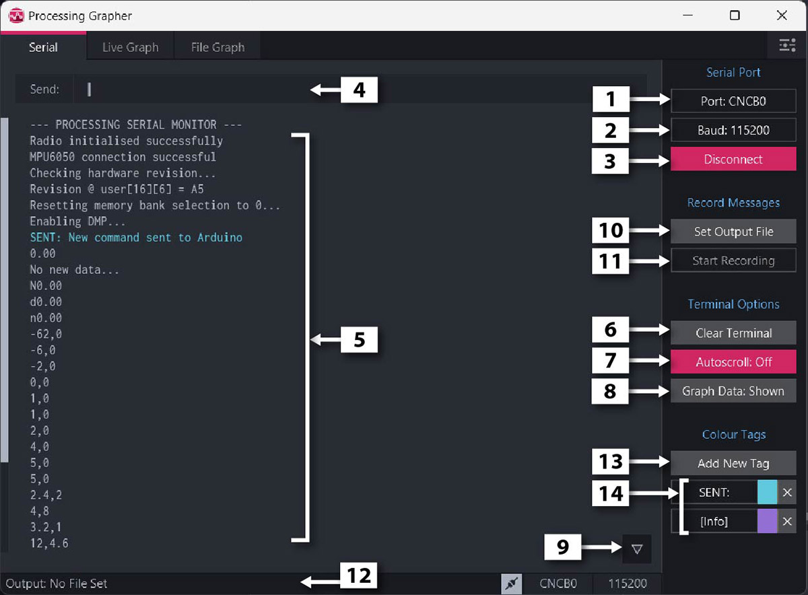
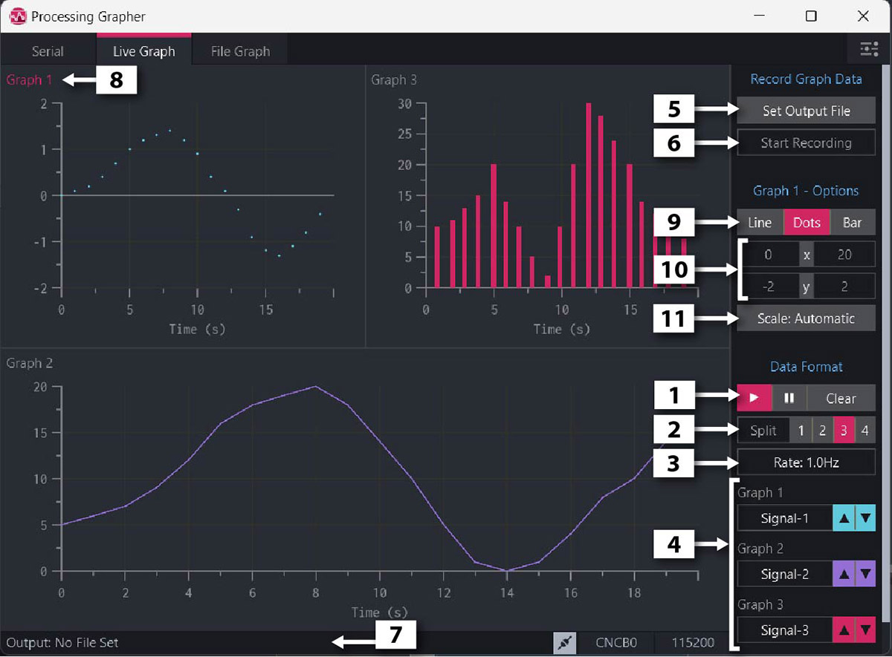
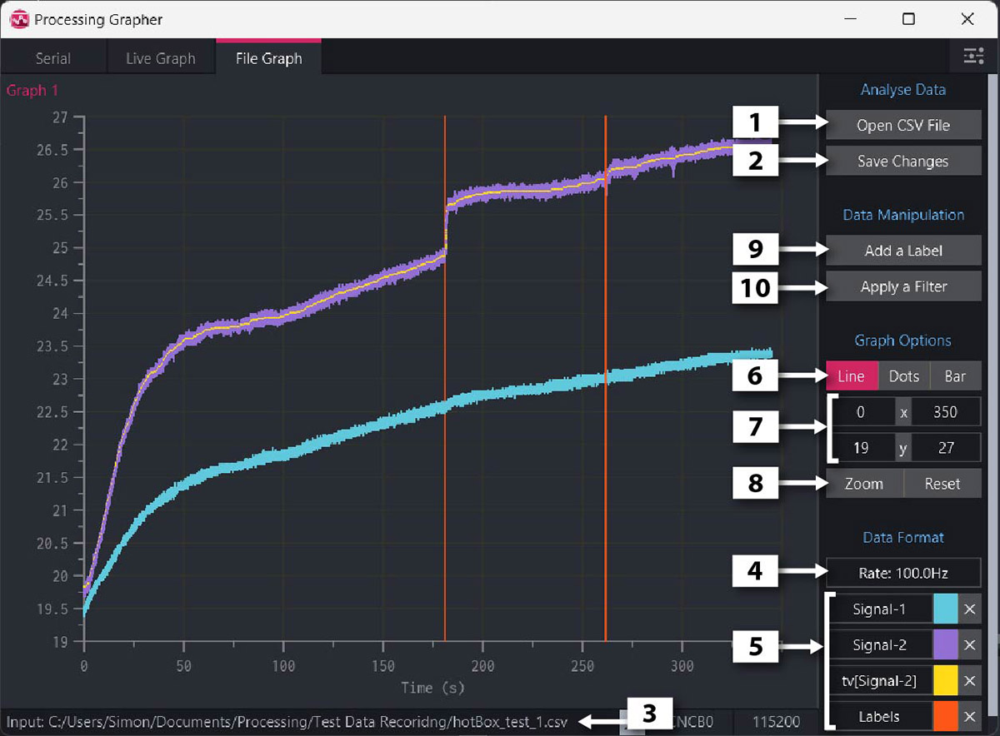
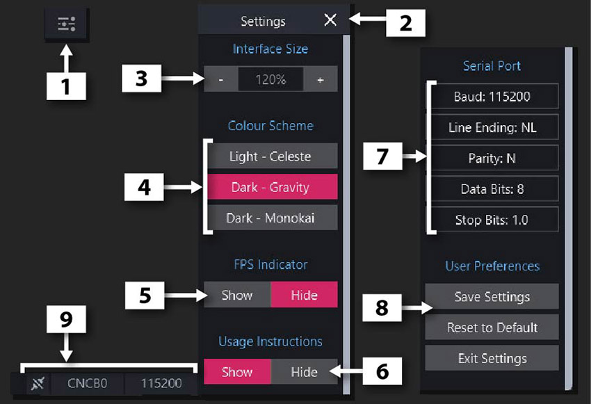

# Instructions and User Guide

> **Processing Grapher** is a serial monitor and real-time plotting software designed for analyzing serial telemetry and sensor data from microcontrollers (Arduino, ESP32, STM32, Teensy, RP2040) and recording that data to files.  
> Original guide & software by **Simon Bluett** ([wired.chillibasket.com](https://wired.chillibasket.com/processing-grapher/)).  
> Modernized for **Processing 4.x (Java 17)** by [Francisco Betancourt](https://github.com/fbetancourt-dev/processing-grapher).

---

## Table of Contents

1. [Installation & Setup](#installation--setup)
2. [The “Serial” Monitor Tab](#the-serial-monitor-tab)
   - [Connecting to a Serial Device](#connecting-to-a-serial-device)
   - [Terminal Console Area](#terminal-console-area)
   - [Recording Received Messages to a File](#recording-received-messages-to-a-file)
   - [Adding Colour Keyword Tags](#adding-colour-keyword-tags)
3. [The “Live Graph” Serial Plotting Tab](#the-live-graph-serial-plotting-tab)
   - [Message Format for Real-time Plotting](#message-format-for-real-time-plotting)
   - [Arduino Telemetry Code Example](#arduino-telemetry-code-example)
   - [Format the Signals and Graphs](#format-the-signals-and-graphs)
   - [Recording Signals to a CSV File](#recording-signals-to-a-csv-file)
   - [Changing Graph Settings](#changing-graph-settings)
   - [Sending a Serial Message / Command](#sending-a-serial-message--command)
4. [The “File Graph” Analysis Tab](#the-file-graph-analysis-tab)
   - [Opening and Saving Files](#opening-and-saving-files)
   - [Formatting the Signals](#formatting-the-signals)
   - [Changing Graph Settings (Zoom & Scale)](#changing-graph-settings-zoom--scale)
   - [Adding Labels and Filtering the Data](#adding-labels-and-filtering-the-data)
5. [Settings Menu](#settings-menu)
   - [Main Program Settings](#main-program-settings)
   - [Advanced Serial Port Settings](#advanced-serial-port-settings)
   - [Serial Port Information Bar](#serial-port-information-bar)
6. [Keyboard Shortcuts Reference](#keyboard-shortcuts-reference)
7. [Linux Setup & Permissions](#linux-setup--permissions)

---

## Installation & Setup

### Running with Processing 4
1. Download and install **Processing 4** from [https://processing.org/download](https://processing.org/download). This version requires **Processing 4.x (Java 17)**.
2. Clone or download the program files from the [GitHub repository](https://github.com/fbetancourt-dev/processing-grapher).
3. Open `ProcessingGrapher/ProcessingGrapher.pde` in the Processing 4 editor. All additional PDE tabs will automatically open.
4. Click the **Run** button (top-left) or press `Ctrl+R`.

### Running from Terminal
```bash
processing-java --sketch=/path/to/ProcessingGrapher --run
```

### Linux Desktop Launcher & Dock Icon
To install the application shortcut and official magenta graph icon into your application menu and dock:
```bash
./install-desktop-shortcut.sh
```

---

## The “Serial” Monitor Tab

  
*__Figure 1:__ The “Serial Monitor” tab, with all the main functions labelled.*

### Connecting to a Serial Device
- **Select Port:** Select the **Port** relating to the device you want to connect to from the sidebar dropdown. The port list will automatically update when new devices are plugged into the computer.
- **Set Baud Rate:** Set the **Baud rate** for the serial communication. The most common rates used with Arduinos are `9600` or `115200` (extended baud rates up to `2000000` are supported).
- **Connect / Disconnect:** Press the **Connect/Disconnect** button to begin and end communication with the serial device. When disconnecting, make sure to hit the disconnect button before you unplug the device! Otherwise the serial port list won’t update properly anymore! *(Shortcut: `CTRL-Q`)*

### Terminal Console Area
- **Sending Messages:** You can send a new message to the connected device by simply typing on the keyboard. Use the left and right arrow keys to edit different parts of the message. To send the message, press the **Enter/Return** key.
- **Console Display:** The terminal console area displays all the sent and received serial messages.
- **Clear Terminal:** Press the **Clear Terminal** button to remove all messages currently displayed in the terminal console.
- **Autoscroll:** The text displayed in the terminal console will automatically scroll down when new messages are received from the device. Press the **Autoscroll: On/Off** button to enable or disable this scrolling.
- **Hide Graph Data:** If the messages contain a mixture of graph data (comma-separated numbers) and other text, the graph data values can be hidden by toggling **Hide Graph Data** to make the other text easier to see.
- **Scroll Memory Jump:** When scrolled up to inspect previous logs, a button appears at the bottom-right which scrolls the serial terminal back down to the most recent message.
- **Text Selection & Clipboard:** Text can be selected with the mouse and copied using `CTRL-C`. Text can also be pasted into the input field using `CTRL-V`. Use `CTRL-A` to select all text.

### Recording Received Messages to a File
- The program makes it easy to save all messages received from the serial device to a text file, where each message is saved on a new line.
- Press the **Set Output File** button to set where the recorded messages will be saved. *(Shortcut: `CTRL-S`)*
- Press **Start/Stop Recording** button to start and end the serial message recording process. *(Shortcut: `CTRL-R`)*
- The output file path where the recorded messages will be saved is shown in the bottom status bar.

### Adding Colour Keyword Tags
The terminal console has a unique feature that it can change the colour of lines which contain specific text or keywords. If you receive a lot of serial messages, this can make it a lot easier to spot the important messages you are looking for.

- Press the **Add New Tag** button to add a new colour keyword tag. A pop-up will appear where you can type the text you want to detect.
- All the existing colour tags are listed at the bottom of the right-hand menu.
- You can click on the name of the tag to edit it.
- To delete the tag, click on the **x** button.
- To change the colour of a specific tag, click on the coloured box next to the tag name. An options menu will appear where a custom colour can be chosen.

---

## The “Live Graph” Serial Plotting Tab

### Message Format for Real-time Plotting
To plot real-time signals received from the serial device, the messages being received need to follow a specific format:
- Each message must contain the current values of all of the signals you want to plot, separated by commas.
- The message must end with the **New Line (`\n`)** character.
- The messages need to be sent at regular time-intervals.
- The message cannot contain any other characters which are not numbers or commas…

When listed like this it sounds confusing, but in practice it is actually very simple! For example, this would be the Arduino code used to plot the Analog Pin values 100 times a second:

### Arduino Telemetry Code Example

```cpp
// Variable used to run code at regular intervals
unsigned long updateTime = 0;

void setup () {	
  // Open up the serial port
  Serial.begin(9600);
}

void loop () {
  // If it is time to check the sensors again
  // 10ms delay = frequency of 100Hz
  if (millis() - updateTime >= 10) {
    updateTime = millis();

    // Read the analog inputs
    int a0pin = analogRead(A0);
    int a1pin = analogRead(A1);
    int a2pin = analogRead(A2);

    // Send the values via serial
    Serial.print(a0pin);
    Serial.print(",");
    Serial.print(a1pin);
    Serial.print(",");
    Serial.println(a2pin);
  }
}
```

  
*__Figure 2:__ “Live Graph” tab that plots serial data in real-time*

### Format the Signals and Graphs
- **Pause & Resume:** The live data on the graphs can be paused and resumed using the buttons in the sidebar. All the old data displayed on the graph can also be cleared using the **Clear** button.
- **Multi-Graph Split:** The program can display incoming signals on up to 4 separate graphs. To change the number of graphs, click on the **1**, **2**, **3** or **4** button next to the **Split** label.
- **Frequency / Data Rate:** By default the program automatically detects the frequency/rate of the data being received. This is used to automatically show the correct time scale on the X-axis of the graph. This frequency can be manually changed by clicking on the **Rate:** button and entering a new number. Leave the input blank to return to the automatic detection mode.
- **Signal List & Ordering:** At the bottom of the right-hand menu, all of the automatically detected signals and their respective colours are listed:
  - You can click on the signal name to change the name to something different. *Note: this option is disabled once data recording has been started.*
  - Click on the **up (▲)** and **down (▼)** arrow buttons to move the signals onto different graphs.
  - If you click the up arrow from **“Graph 1”**, then that signal will be used as the **X-axis** for all the other signals (enabling XY / phase plots).

### Recording Signals to a CSV File
- The program makes it easy to save all messages received from the serial device to a CSV (comma-separated values) data file, which can opened in spreadsheets (Excel, Calc) or MATLAB/Python for further analysis.
- Press the **Set Output File** button to set where the recorded messages will be saved. *(Shortcut: `CTRL-S`)*
- Press **Start/Stop Recording** button to start and end the serial message recording process. *(Shortcut: `CTRL-R`)*
- The output file path where the recorded messages will be saved is shown in the bottom status bar.
- For long-duration logging, files are automatically split into manageable chunks of 100,000 rows.

### Changing Graph Settings
- To change the settings associated with a specific graph, click anywhere on the graph to select it. The title of the graph will turn red to show that it has been selected. The number of the selected graph is also shown in the menu: **Graph X - Options**.
- You can change the way in which the data is displayed on the graph by clicking the **Line** (line graph), **Dots** (scatter graph) or **Bar** (bar chart) buttons.
- **Manual Axis Limits:** If the value of the signals exceeds the current y-axis scaling, the minimum and maximum y-axis values will automatically be increased so that all the data fits onto the graph. However, you can also manually change the minimum and maximum Y- and X-axis values by clicking on the X and Y numbers in the menu.
- **Scaling Modes:** To prevent the graph Y-axis scale from resizing automatically if the data exceeds the graph bounds, click on this button to change between:
  - **`Scale: Auto Expand`**: graph y-axis is increased if data exceeds the limits, but does not contract.
  - **`Scale: Automatic`**: graph y-axis expands and contracts dynamically to fit the current visible data.
  - **`Scale: Manual`**: user specified fixed y-axis limits.

### Sending a Serial Message / Command
While on the **“Live Graph”** tab, it is possible to send a serial message to the connected device without going to the “Serial” tab (for example if you need to keep an eye on the data being plotted on the graphs):
- Press the **`CTRL-M`** shortcut key on your keyboard.
- If there is a serial device connected, then a pop-up window will appear where you can type the message you want to send.

---

## The “File Graph” Analysis Tab

  
*__Figure 3:__ The “File Graph” tab can plot data from a CSV file*

### Opening and Saving Files
The “File Graph” tab can be used to analyse data which you recorded earlier. This makes it easy to quickly look back at the data and look at regions of interest.
- **Open CSV File:** To open a `*.CSV` data file, click on the **Open CSV File** button. All the signals contained within the file should be plotted on the graph. *(Shortcut: `CTRL-O`)*
- **Save Changes:** If any changes were made to the data (such as applying a filter or adding labels), click on **Save Changes** to open a dialogue which allows you to save the data to a new file. *(Shortcut: `CTRL-S`)*
- The location of data file which is currently open can be seen on the bottom status bar.

### Formatting the Signals
- **X-Axis Detection:** To determine the X-axis of the graph, there are two options:
  - If the data file contains a column which should be used as the X-axis, the heading of the column should start with the text: **`x:`** (e.g. `x:time,signal1,signal2`). To show that the program has detected this column, button **(4)** in the sidebar will show the name of the X-axis data column.
  - If no X-axis is present in the data file, you can set your own data rate/frequency in the exact same way as in the “Live Graph” tab. Click on the **Rate: 100Hz** button and input the desired frequency into the pop-up window.
- **Signal List:** All the signals contained within the file (with exception to the x-axis column, if present) are shown at the bottom of the menu bar. To remove a signal from the graph, click on the **x** button beside the signal name.

### Changing Graph Settings (Zoom & Scale)
- You can change the way in which the data is displayed on the graph by clicking the **Line** (line graph), **Dots** (scatter graph) or **Bar** (bar chart) buttons.
- You can manually change the minimum and maximum Y- and X-axis values by clicking on the X and Y numbers in the menu.
- **Interactive Zooming:** To zoom into a specific region of the graph, click on the **Zoom** button. The mouse cursor will change to a cross. You can then click on two points on the graph, and the chart will be updated to zoom into the rectangle between those two points.
- **Reset Zoom:** To reset the graph back to its original size, click on the **Reset** button. Press `Esc` while selecting to cancel an active zoom operation.

### Adding Labels and Filtering the Data
- **Adding Labels:** Labels consist of a vertical line which can be used to mark regions of interest on the graph. To add a new label, click on the **Add Label** button (the mouse will change to a cross), and then click on the graph to place the label marker. A new signal is added to the file to record the position of the labels.
- **Applying Filters:** Filters can be applied to the data by pressing on the **Apply a Filter** button:
  1. Select the signal you want to filter from the list which appears.
  2. Select a filter to apply to the data from the available options:
     - **Noise Removal:**
       - *Moving Average* (`avg`): Sliding window smoothing.
       - *1D Total Variance* (`tv`): Edge-preserving denoising.
       - *RC Low Pass* (`lp`): First-order low-pass filter (user cutoff frequency).
       - *RC High Pass* (`hp`): High-pass filter removing DC drift.
     - **Mathematical Functions:**
       - *Absolute Value* (`abs`): $|x|$ rectification.
       - *Squared* (`squ`): $x^2$ power computation.
       - *Derivative* (`Δ/dt`): Instantaneous rate of change.
       - *Integral* (`Σdt`): Numerical accumulation over time.
     - **Signal Analysis:**
       - *Fourier Transform* (`fft`): Frequency spectrum analysis.
       - *Enclosed Area* (`ea`): Area enclosed within cyclic/hysteresis loops.
  3. If any additional user input is required (for example to specify filter cut-off frequency), a pop-up dialogue will appear.
  4. Once complete, the filtered signal is added as a new signal to the file.

---

## Settings Menu

  
*__Figure 4:__ The settings menu and the Serial Port information bar.*

### Main Program Settings
- **Opening Settings:** To open the main settings menu, click on the gear icon in the top-right corner of the program.
- **Closing Settings:** Once open, the settings menu can be closed again by clicking on the **x** icon in the same location (or pressing `Esc`).
- **UI Scaling:** The size of the entire interface and all text can be increased or decreased to suit your preference (`Ctrl +` / `Ctrl -`).
- **Colour Schemes:** There are three colour schemes for the program which can be easily switched within the menu:
  - **Monokai** (Dark, high contrast)
  - **One Dark Gravity** (Dark, modern slate)
  - **Celeste** (Bright, light mode)
- **FPS Indicator:** A small indicator of the current frame rate of the program can be enabled or disabled.
- **Startup Guides:** The instruction guides which are shown in the program when no serial devices are connected can be disabled.

### Advanced Serial Port Settings
- Advanced settings related to the serial port configurations (parity, data bits, stop bits, custom delimiters) can be changed here *(Note: options can only be changed when the serial port is disconnected)*.
- **Supported Delimiters:** Comma (`,`), Semicolon (`;`), Tab (`\t`), Colon (`:`), Space (` `), Underscore (`_`), Vertical Bar (`|`).
- **Save Settings:** All the settings within the menu can be saved, meaning that they will remain when the program is closed and started again. The settings can also easily be returned to their default values.

### Serial Port Information Bar
- On the bottom information bar of all tabs, the current serial port settings and connection status are shown.
- The buttons can be clicked to quickly connect or disconnect the serial device and alter the port or the baud rate without switching tabs.

---

## Keyboard Shortcuts Reference

| Shortcut | Scope | Function |
|---|---|---|
| **CTRL-Q** | Global | Connect / Disconnect serial port |
| **CTRL-TAB** | Global | Cycle to next tab (Serial → Live Graph → File Graph) |
| **CTRL-S** | Serial / Live Graph | Set output file path for recording |
| **CTRL-S** | File Graph | Save changes to file |
| **CTRL-R** | Serial / Live Graph | Start / Stop recording data |
| **CTRL-O** | File Graph | Open CSV data file |
| **CTRL-M** | Global | Send serial message from any tab |
| **CTRL +** / **CTRL =** | Global | Increase UI scaling |
| **CTRL -** / **CTRL _** | Global | Decrease UI scaling |
| **CTRL-C** | Serial Monitor | Copy highlighted text to clipboard |
| **CTRL-V** | Serial Monitor | Paste text from clipboard |
| **CTRL-A** | Serial Monitor | Select all text in terminal |
| **ESC** | Modals / Zoom | Cancel zoom selection or dismiss dialog / settings |
| **Page Up / Down** | Serial Monitor | Fast-scroll terminal console |
| **Up / Down** | Sidebar | Move signals between graphs or scroll menus |
| **Enter / Return** | Serial Monitor | Transmit entered serial message |

---

## Linux Setup & Permissions

If the error message `Permission Denied` appears when trying to connect to a serial port on Linux, your user account does not have access permissions for serial hardware.

Run these two commands in terminal (replace `<user>` with your username):
```bash
sudo usermod -a -G dialout $USER
sudo usermod -a -G tty $USER
```
**Reboot the computer** (or log out and log back in) to apply the changes.

---

## License & Credits
- **Original Author:** Simon Bluett ([wired.chillibasket.com](https://wired.chillibasket.com/processing-grapher/))
- **License:** GNU General Public License v3 (GPL-3.0)
- **Repository:** [https://github.com/fbetancourt-dev/processing-grapher](https://github.com/fbetancourt-dev/processing-grapher)
